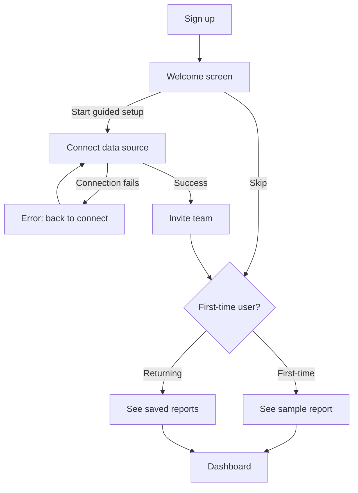
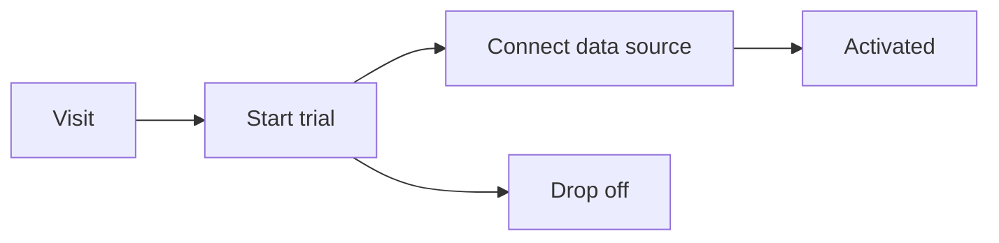

# Turn selection into… (using AI) — test bench

Real content for exercising every case of the **Turn selection into… (using AI)** feature.

How to use each section:

1. Select the lines under **Select this**.
2. Open the bubble menu, click the sparkle (AI) button — or open **Turn into** and use the **Using AI** group.
3. Pick the target, choose **Replace selection** or **Add below**, then **Copy prompt**.
4. Paste the prompt into your file-aware AI (Claude Code, Cursor, the VS Code AI). It edits this file directly.

The content below is internally consistent — it all describes a fictional product team ("Northwind Analytics") shipping their Q3 release — so converted blocks should read sensibly.

---

## 1. Table — from loose notes

**Action:** Table · **Try:** Replace, then undo and try Add below.

**Select this:**

Northwind's Q3 work breaks down across four owners. Maya is leading the new onboarding flow and wants it in review by July 12. Tom owns the billing migration, which is blocked on the finance sign-off and slipped to July 20. Dev is rebuilding the analytics dashboard and is targeting July 9. Priya picked up the public API docs refresh and expects to finish by July 15, though it's low priority and may move.

**What good looks like:** a table with columns like Task, Owner, Due, Status/Notes — one row per item, dates as 2026-07-12 style.

---

## 2. Kanban board — from a flat task list

**Action:** Kanban board · **Try:** Replace.

**Select this:**

- Draft onboarding copy — Maya — in progress
- Wire up the welcome checklist — Maya — in progress
- Migrate legacy billing records — Tom — blocked on finance
- Switch billing webhooks to the new endpoint — Tom — not started
- Rebuild the dashboard charts — Dev — in progress
- Add CSV export to reports — Dev — not started
- Refresh the public API reference — Priya — done
- Record the launch demo video — Priya — not started

**What good looks like:** a board block with columns such as Not started / In progress / Blocked / Done, each card's Status matching a column name exactly, an Owner field, and a hidden id column. Cards land in the right lane based on the trailing status text.

---

## 3. Mermaid diagram — from a process description

**Action:** Mermaid diagram · **Try:** Add below (so you keep the prose and get a diagram).

**Select this:**

When a new customer signs up, they first land on the welcome screen. From there they either start the guided setup or skip straight to the dashboard. If they start guided setup, they connect a data source, then invite their team, then reach the dashboard. If a data source connection fails, they're sent back to the connect step with an error. Once at the dashboard, first-time users see the sample report; returning users see their own saved reports.

**What good looks like:** a rendered flowchart with branches for "start guided setup" vs "skip", a failure loop back to the connect step, and the first-time vs returning split at the dashboard.

---

## 4. Summary — condense a long passage (Phase 2)

**Action:** Summary · **Try:** Add below.

**Select this:**

The Q3 release is the largest update Northwind has shipped since launch. The headline change is a redesigned onboarding flow that cuts the steps to first value from nine to four, based on the funnel analysis we ran in May, where 38% of trials dropped off before connecting a data source. Alongside onboarding, we're migrating every account off the legacy billing system onto the new metered-usage engine, which unblocks usage-based pricing — a top request from enterprise prospects throughout Q1 and Q2. The analytics dashboard has been rebuilt on the new charting library, roughly halving render time on large datasets and finally supporting dark mode. Smaller items round out the release: CSV export on every report, a refreshed public API reference, and a launch demo video. The one open risk is the billing migration, which is gated on a finance sign-off that has slipped twice; if it slips again we'll ship onboarding and the dashboard on schedule and fast-follow with billing.

**Summary:**

- **Headline:** Q3 is Northwind's largest release since launch — a redesigned onboarding flow cuts steps to first value from nine to four, addressing the 38% of trials that dropped off before connecting a data source (per the May funnel analysis).
- **Billing migration:** every account moves off the legacy system onto the new metered-usage engine, unblocking usage-based pricing — a top enterprise request from Q1–Q2.
- **Dashboard:** rebuilt on a new charting library, roughly halving render time on large datasets and adding dark mode.
- **Smaller items:** CSV export on every report, a refreshed public API reference, and a launch demo video.
- **Open risk:** the billing migration is gated on a finance sign-off that has slipped twice; if it slips again, onboarding and the dashboard ship on schedule and billing follows as a fast-follow.

**What good looks like:** a tight 3–5 bullet (or short paragraph) summary capturing the headline, the billing risk, and the supporting items.

---

## 5. Action items — extract todos from meeting notes (Phase 2)

**Action:** Action items / task list · **Try:** Add below.

**Select this:**

Standup notes, July 1. Maya said onboarding copy is mostly done but she needs final legal review of the welcome email before July 10. Tom is still blocked — he'll escalate the finance sign-off to Dana today and wants a decision by Wednesday. Dev flagged that the dashboard dark-mode contrast fails accessibility on two chart types and will fix before the freeze. Priya offered to draft the launch announcement once the demo video is recorded. We agreed someone needs to update the pricing page before billing goes live, but nobody owns it yet.

**What good looks like:** a task list with clear, owned, checkable items — including the unowned "update pricing page" flagged as needing an owner.

---

## 6. Outline — organize flat notes into nested headings (Phase 2)

**Action:** Outline / nested headings · **Try:** Replace.

**Select this:**

launch channels: email to existing customers, in-app banner, blog post, changelog entry. email needs: subject line, hero image, three feature highlights, CTA to the demo. in-app banner needs: copy under 80 chars, dismiss behavior, target only logged-in admins. blog post needs: narrative intro, the funnel stat, screenshots, customer quote. metrics to watch after launch: activation rate, trial-to-paid conversion, dashboard load time, support ticket volume.

**What good looks like:** a clean nested outline (headings + sub-bullets) grouping the channels, each channel's requirements, and the metrics section.

---

## 7. Timeline — order events chronologically (Phase 2)

**Action:** Timeline · **Try:** Replace.

**Select this:**

The dashboard rebuild started in late May. Onboarding redesign kicked off June 2. The funnel analysis that justified it was actually finished back in mid-May. Billing migration was supposed to begin June 15 but is still blocked. Code freeze is July 22. Launch is set for July 29. The demo video shoot is booked for July 24. Finance sign-off was originally promised June 20.

**What good looks like:** events sorted earliest to latest (mid-May funnel analysis → late-May dashboard start → June 2 onboarding → … → July 29 launch), with the blocked/slipped items marked.

---

## 8. Edge case — a selection that includes images

**Action:** Table · **Try:** Replace. Checks that images are read/kept, not dropped.

**Select this:**

Competitor dashboards we reviewed for the redesign:

- Acme Insights — clean, but no dark mode.

  

- BluePeak — great filtering, cluttered header.

  

- Northwind (current) — slow on big datasets.

  

**What good looks like:** a table with a row per competitor; the image rides along as a cell (the `` link is preserved, never dropped). If the AI can open the image files, it may also factor in what they show.

> Note: the image paths above are placeholders. Drop real PNGs at `./assets/` to test the "AI actually reads the image" path; otherwise the AI should fall back to the alt text and link.

---

## 9. Edge case — a selection that includes an existing diagram

**Action:** Table · **Try:** Add below. Checks that an existing block is read as data, not destroyed.

**Select this:**

Our current signup funnel, for reference:

Stage conversion last month: Visit to trial 12%, trial to connect 62%, connect to activated 81%.

**What good looks like:** the AI reads both the diagram stages and the conversion line, and produces a table of funnel stages with their conversion rates — leaving (Add below) the original diagram and notes intact.