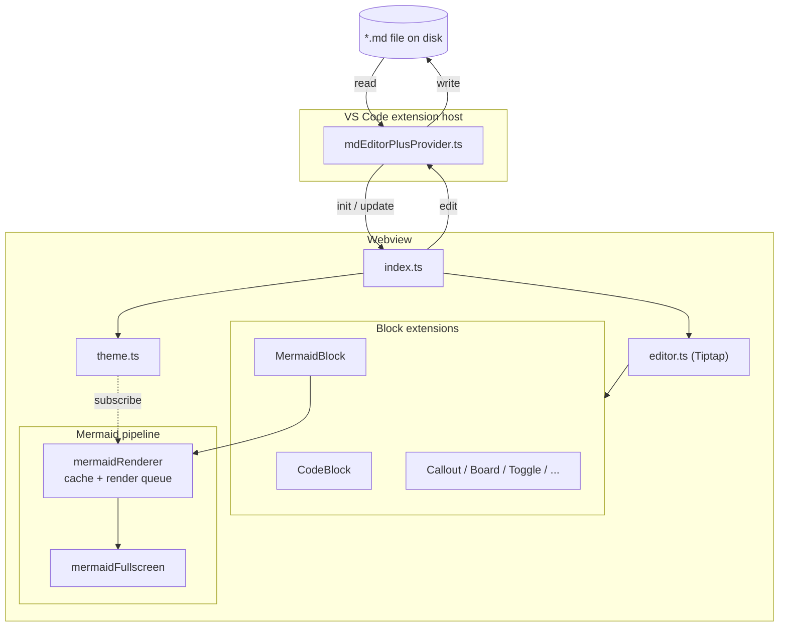
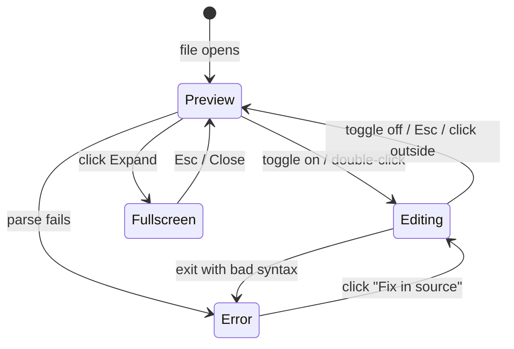
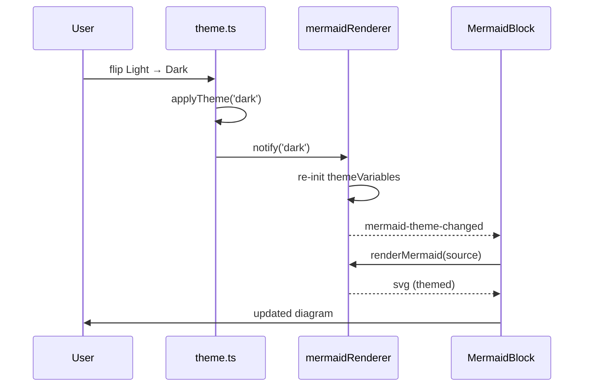

# MD Editor Plus — architecture

A quick map of how the extension is wired, used to smoke-test the new mermaid block.

## How a `.md` file gets to your eyes

## Mermaid block lifecycle

## Theme propagation

## Plain text below — sanity check

If everything is wired right, the three blocks above render as diagrams and this paragraph stays as plain text. Toggle **Edit** on any of them to flip into source mode (the snackbar should fade in), and click **Expand** to open the fullscreen modal.
